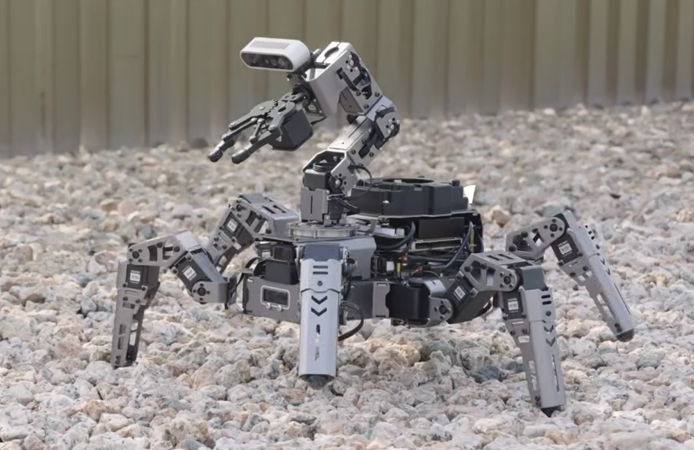

# Entech × Hiwonder ROS 2

[ไทย](README.md) | English

ROS 2 code for the Hiwonder robots that Entech teaches with and builds on. There is **one folder per robot model**, and each folder is its own colcon workspace. More models will be added over time.

<p align="center">
  
</p>

## Robots in this repo

| Model | Robot | Real robot | Simulation (PC) | Docs |
|---|---|---|---|---|
| [ROSpider](ROSpider/) | 6-legged spider robot (18 servos) + robot arm, depth camera, LiDAR | Jetson, Ubuntu 22.04, ROS 2 Humble | Ubuntu 24.04, ROS 2 Jazzy, Gazebo Harmonic | [README](ROSpider/README.en.md) (sim + workshop exercises), [REAL_ROBOT](ROSpider/REAL_ROBOT.en.md) (real robot), [Hiwonder docs](https://docs.hiwonder.com/projects/ROSpider/en/jetson-orin-nano-version/) |

## Layout

```
entech_hiwonder_ros2_ws/
├── README.md          Thai version of this file
├── README.en.md       ← this file
├── CLAUDE.md          technical notes for developers
├── docs/              specs and plans for the features we added
└── ROSpider/          ROSpider's colcon workspace
```

## Important rules

- **Build only from inside a model's folder.** Never run `colcon build` in this folder: Hiwonder's models reuse package names (`app`, `bringup`, `controller`, ...) and colcon rejects duplicates.
- **Never source two models' `install/` in the same terminal.**
- Each model's code is pulled from Hiwonder's repo with `git subtree` (its history is kept). Entech's additions live in this repo.

```bash
cd ~/entech_hiwonder_ros2_ws/ROSpider
source /opt/ros/jazzy/setup.bash
colcon build --symlink-install
```

## Pulling updates from Hiwonder

```bash
git subtree pull --prefix=ROSpider hiwonder Jetson_Nano_ROS2
```

The remote `hiwonder` is https://github.com/Hiwonder/ROSpider.git

## Adding a new robot model

1. `git remote add <name> <Hiwonder repo URL>`
2. `git subtree add --prefix=<model> <name> <branch>`
3. Add a row to the "Robots in this repo" table above (in both languages)
